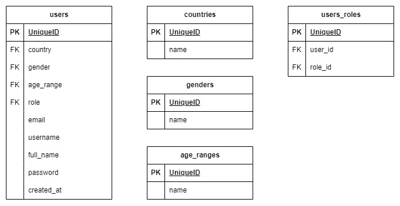
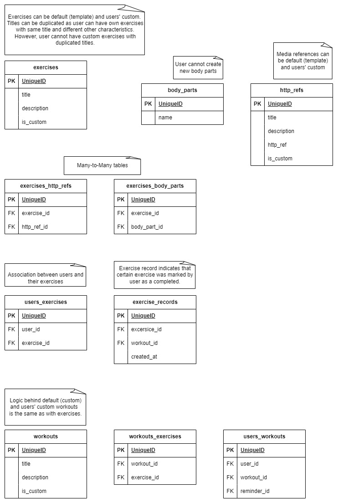
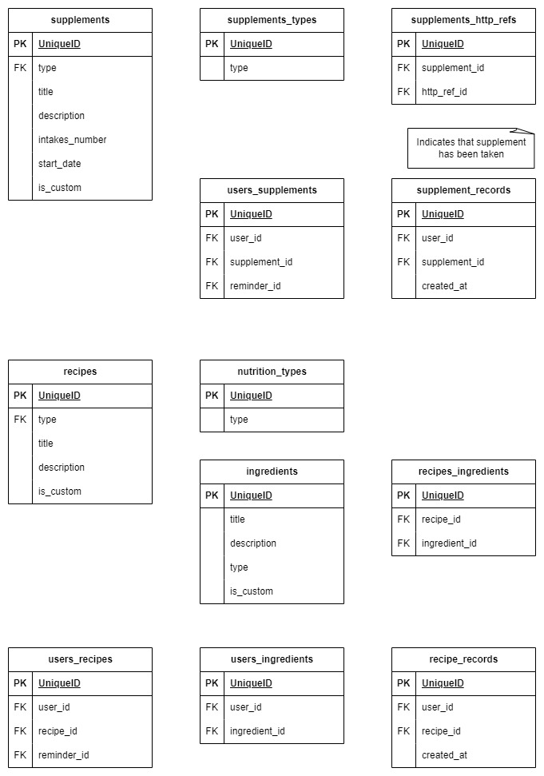
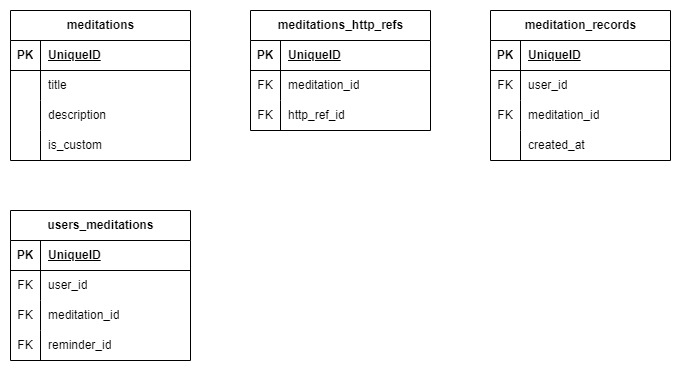
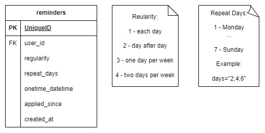
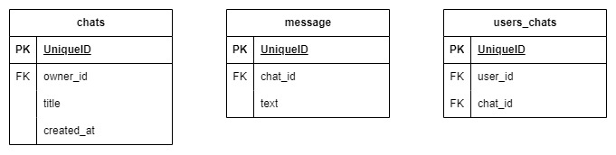
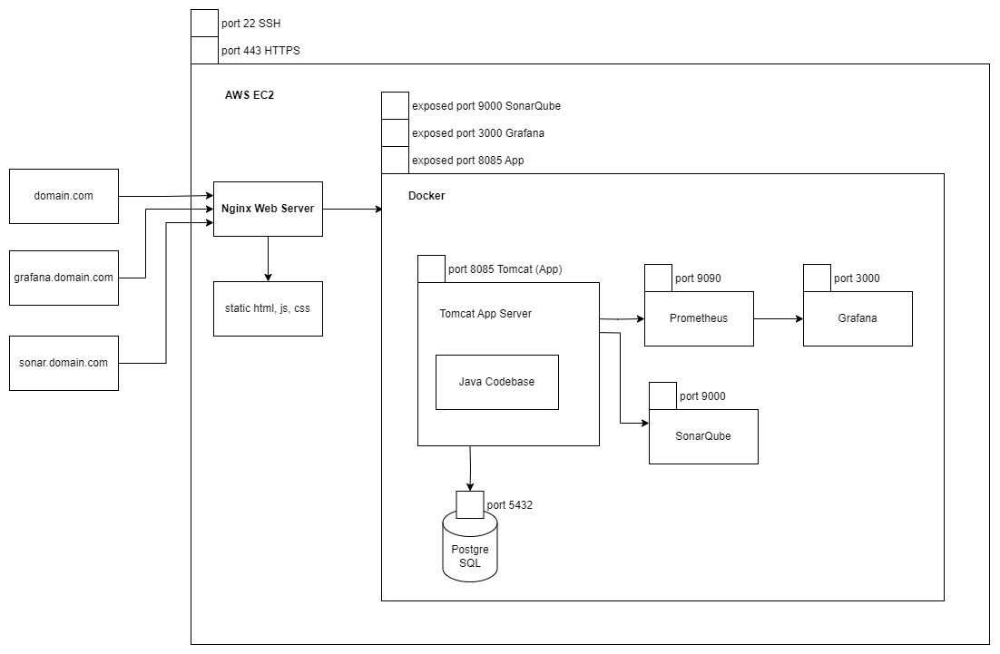

# Healthy Lifestyle App

[REST API Endpoints](#rest-api-endpoints) 
[Database Schema](#database-schema) 
[Deployment Schema](#deployment-schema) 

## REST API Endpoints

### User Role

#### Users & Auth
Signup (create user): POST /api/v1/signup 
Login: POST /api/v1/login 
Is authenticated (validate token): GET /api/v1/authenticate (JWT) 
Get user details: GET /api/v1/users/{user_id} (JWT) 
Update user: PATCH /api/v1/users/{user_id} (JWT) 
Delete user: DELETE /api/v1/users/{user_id} (JWT) 

#### Body Parts
List all body parts: GET /api/v1/workouts/bodyParts 

#### Media References
List template references: GET /api/v1/workouts/httpRefs/templates 
List all references or custom only: GET /api/v1/workouts/httpRefs?isCustomOnly= (JWT) 
Create custom reference: POST /api/v1/workouts/httpRefs (JWT) 
Update custom reference: PATCH /api/v1/workouts/httpRefs/{httpRef_id} (JWT) 
Delete custom reference: DELETE /api/v1/workouts/httpRefs/{httpRef_id} (JWT) 

#### Exercises
List template exercises: GET /api/v1/workouts/exercises/templates 
List all exercises or custom only: GET /api/v1/workouts/exercises?isCustomOnly= (JWT) 
Create custom exercise: POST /api/v1/workouts/exercises (JWT) 
Associate exercise as completed:  POST /api/v1/workouts/exercises/{exercise_id}/{user_id} (JWT) 
Update custom exercise: PATCH /api/v1/workouts/exercises/{exercise_id} (JWT) 
Delete custom exercise: DELETE /api/v1/workouts/exercises/{exercise_id} (JWT) 

#### Workouts
List template workouts: GET /api/v1/workouts/templates 
List all workouts or custom only: GET /api/v1/workouts?isCustomOnly= (JWT) 
Create custom workout: POST /api/v1/workouts (JWT) 
Update custom workout: PATCH /api/v1/workouts/{workout_id} (JWT) 
Delete custom workout: DELETE /api/v1/workouts/{workout_id} (JWT) 

#### Nutrition Recipes
List template recipes: GET /api/v1/nutrition/recipes/templates 
List all recipes or custom only: GET /api/v1/nutrition/recipes?isCustomOnly= (JWT) 
Create custom recipe: POST /api/v1/nutrition/recipes (JWT) 
Associate recipe (dish) as completed:  POST /api/v1/nutrition/recipes/{recipe_id}/{user_id} (JWT) 
Update custom recipe: PATCH /api/v1/nutrition/recipes/{recipet_id} (JWT) 
Delete custom recipe: DELETE /api/v1/nutrition/recipes/{recipe_id} (JWT) 

#### Nutrition Supplements
List template supplements: GET /api/v1/nutrition/supplements/templates 
List all supplements or custom only: GET /api/v1/nutrition/supplements?isCustomOnly= (JWT) 
Create custom supplement: POST /api/v1/nutrition/supplements (JWT) 
Associate supplement intake as completed:  POST /api/v1/nutrition/supplements/{supplement_id}/{user_id} (JWT) 
Update custom supplement: PATCH /api/v1/nutrition/supplements/{supplement_id} (JWT) 
Delete custom supplement: DELETE /api/v1/nutrition/supplements/{supplement_id} (JWT) 

#### Meditations
List template meditations: GET /api/v1/meditations/templates 
List all meditations or custom only: GET /api/v1/meditations?isCustomOnly= (JWT) 
Create custom meditation: POST /api/v1/meditations (JWT) 
Associate meditation as completed:  POST /api/v1/meditations/{meditation_id}/{user_id} (JWT) 
Update custom meditation: PATCH /api/v1/meditations/{meditation_id} (JWT) 
Delete custom meditation: DELETE /api/v1/meditations/{meditation_id} (JWT) 

#### Calendar
List user’s reminders: GET /api/v1/calendar/{user_id}?startDate=&endDate=&eventType=&eventStatus (JWT) 
Create reminder: POST /api/v1/calendar (JWT) 
Update reminder: PATCH /api/v1/calendar/{reminder_id} (JWT) 
Delete reminder: DELETE  /api/v1/calendar/{reminder_id} (JWT) 

#### Chats
List all user’s chats: GET /api/v1/chats/{user_id} (JWT) 
Get chat by id: GET /api/v1/chats/{chat_id} (JWT) 
Create chat: POST /api/v1/chats (JWT) 
Update chat (title only): PATCH /api/v1/chats/{chat_id} (JWT) 
Delete chat: DELETE /api/v1/chats/{chat_id} (JWT) 

#### Chats Messages
List all chat’s messages GET /api/v1/chats/{chat_id}/messages (JWT) 
Create message  POST /api/v1/chats/{chat_id}/messages (JWT) 

[Top](#healthy-lifestyle-app)

### Admin Role (Admin Panel)

#### Manage Users

#### Manage Template Body Parts

#### Manage Template Media References

#### Manage Template Exercises

#### Manage Template Workouts

#### Manage Template Recipes

#### Manage Template Supplements

#### Manage Template Meditations

#### Manage Chats

[Top](#healthy-lifestyle-app)

## Database Schema

### Users

 
[Top](#healthy-lifestyle-app)

### Workouts

 
[Top](#healthy-lifestyle-app)

### Nutrition

 
[Top](#healthy-lifestyle-app)

### Meditations

 
[Top](#healthy-lifestyle-app)

### Calendar

 
[Top](#healthy-lifestyle-app)

### Chats

 
[Top](#healthy-lifestyle-app)

## Deployment Schema

 
[Top](#healthy-lifestyle-app)
